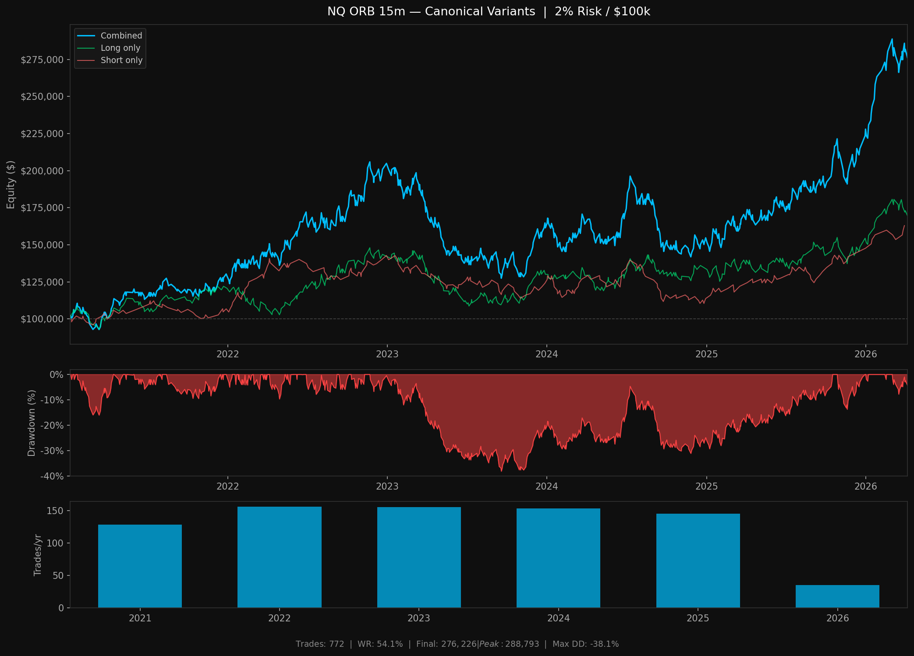
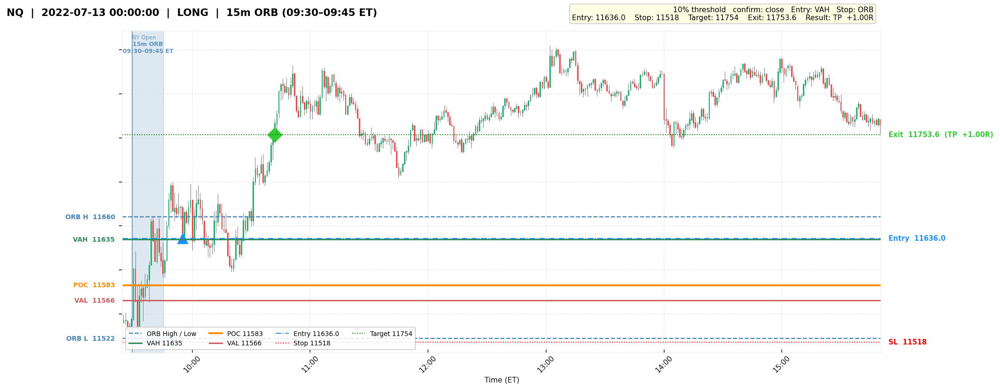
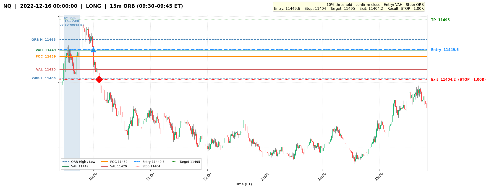
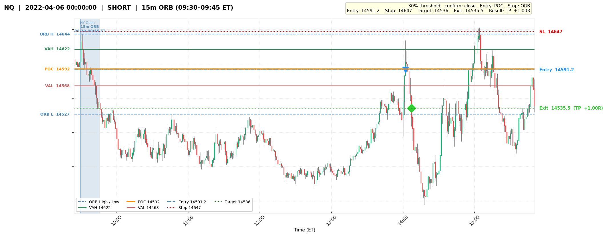
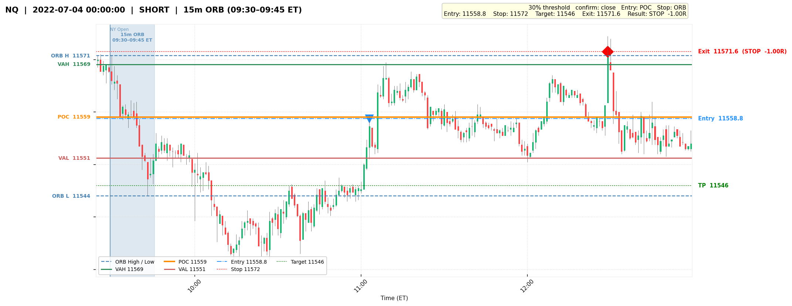

# NQ ORB Retrace — Backtester

A from-scratch backtesting engine for an Opening Range Breakout retracement strategy on NQ E-mini futures (NAS100), built in Python.

---

## Strategy

The strategy trades a retracement into the Opening Range after a confirmed breakout.

**Opening Range:** 09:30–09:45 ET (15 minutes). Volume Profile (VAH, POC, VAL) is calculated from the ORB bars using 24 dynamic buckets, matching TradingView's Fixed Range Volume Profile (Row Size = 24).

**Entry logic:**
- Price breaks out beyond the ORB extreme by a minimum threshold (% of ORB size)
- Confirmation requires a 1m bar close beyond the threshold — no wick entries
- After confirmation, the strategy waits for price to retrace to a VP level inside the range
- Entry fills when price touches the level

**Exit logic:**
- Target: 1:1R (symmetric stop distance)
- Stop: ORB extreme + buffer
- EOD force-close: 15:40 ET
- Entry cutoff: 14:59 ET

**Canonical variants (selected from 18-variant sweep per direction):**

| Direction | Entry | Stop | Threshold | Trades | WR | Expectancy | Total R | Max DD |
|---|---|---|---|---|---|---|---|---|
| Long | VAH | ORB low | 10% | 484 | 53.5% | +0.063R | +30.7R | -14.9R |
| Short | POC | ORB high | 30% | 288 | 55.2% | +0.094R | +27.1R | -11.7R |

*2021–2026, NQ.v.0 continuous contract, 1m OHLCV (Databento)*

---

## Equity Curve

2% risk per trade, compounding, $100,000 starting equity:



---

## Engine Design

The backtest engine (`backtest/engine.py`) is built for correctness and speed:

- **Vectorised bar scanning** — all entry/exit logic uses NumPy array operations. No `iterrows()`.
- **Day context pre-computation** — ORB, VP, breakout flags, and post-ORB bar arrays are built once per day and reused across all variant evaluations (`build_day_context`).
- **Fast timestamp comparison** — timestamps converted to int64 nanoseconds for O(log n) searchsorted lookups rather than repeated DatetimeIndex comparisons.
- **Correct entry-bar handling** — target cannot fire on the same bar as entry; only stop is valid at bar 0 of an entry.
- **MFE/MAE tracking** — Maximum Favourable/Adverse Excursion recorded per trade in R units for post-hoc analysis.

---

## Analysis

The full variant sweep and analysis is in [`results/NQ_ORB_15m_backtest_analysis_final.md`](results/NQ_ORB_15m_backtest_analysis_final.md), including:

- 18-variant sweep per direction (3 thresholds × 3 entry levels × 2 stop types)
- Year-by-year breakdown (2021–2026)
- Directional filter analysis across 4 timeframes (15m, 1h, 4h, 1d)
- Edge concentrations by market structure regime

**Directional filter finding:** Filtering by 1h + 4h bearish structure concentrates edge significantly:

| Direction | Trades | WR | Expectancy |
|---|---|---|---|
| Long (1h+4h bearish) | ~103 (~20/yr) | 58.3% | +0.173R |
| Short (1h+4h bearish) | ~140 (~27/yr) | 60.7% | +0.194R |

---

## Sample Charts

71 sample trades (36 long, 35 short) across 2021–2026 — one win and one loss per direction per year, plus extras for 2026.

| Long — Target | Long — Stop |
|---|---|
|  |  |

| Short — Target | Short — Stop |
|---|---|
|  |  |

Full sample set: [`charts/samples/`](charts/samples/)

---

## Stack

- Python 3.11
- pandas, numpy, matplotlib
- Data: Databento NQ.v.0 continuous contract (not included — see `data/README.md`)

## Requirements

```
pip install -r requirements.txt
```
