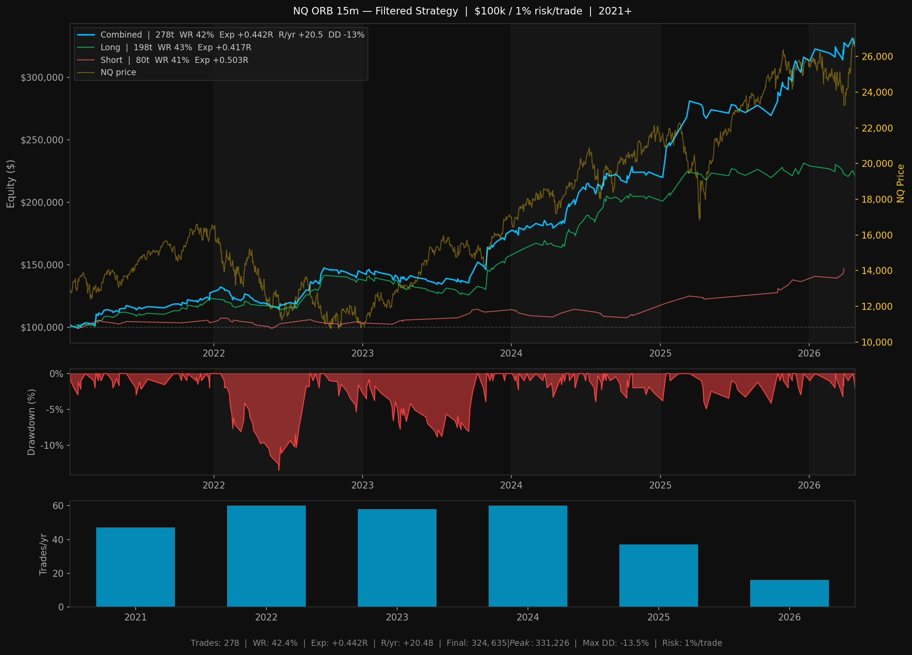
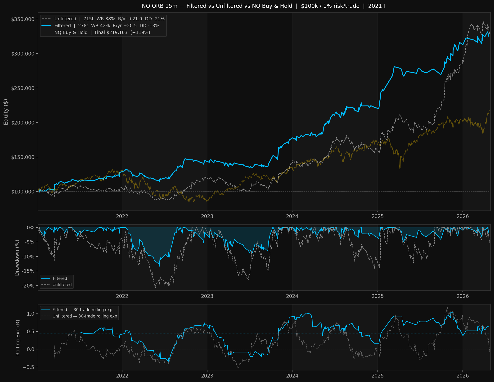
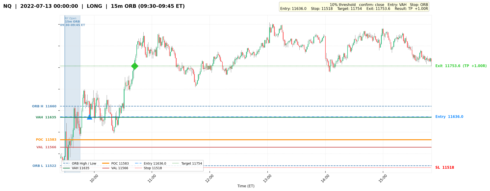
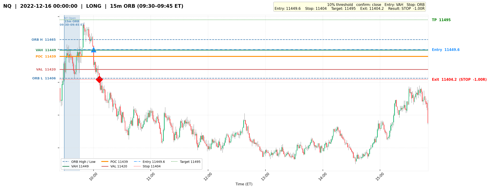
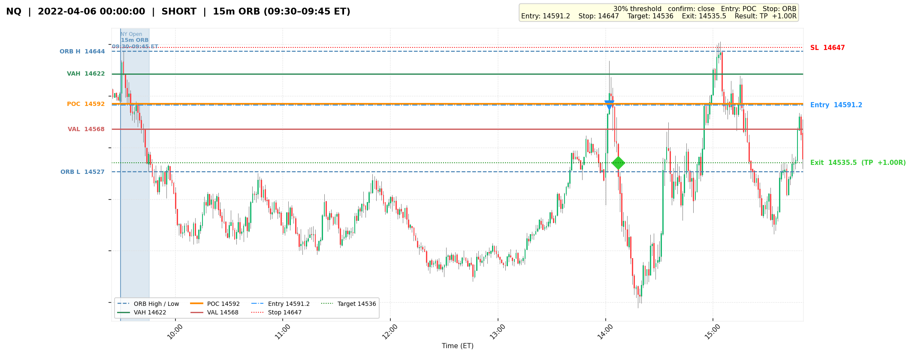
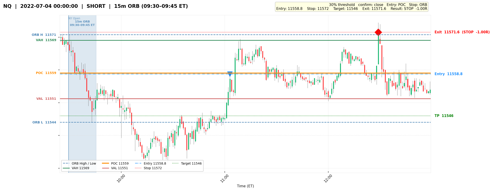

# NQ ORB Retrace — Backtester

A from-scratch backtesting engine for an Opening Range Breakout retracement strategy on NQ E-mini futures (NAS100), built in Python.

---

## Strategy

The strategy trades a retracement into the Opening Range after a confirmed breakout. The retrace to a VP level provides a defined-risk entry point to participate in the continuation of the breakout beyond the original ORB extreme.

**Opening Range:** 09:30–09:45 ET (15 minutes). Volume Profile (VAH, POC, VAL) is calculated from the ORB bars.

**Entry logic:**
- Price breaks out beyond the ORB extreme by a minimum threshold
- Confirmation requires a 1m bar close beyond the threshold — no wick entries
- After confirmation, the strategy waits for price to retrace to a VP level inside the range
- Entry fills when price touches the level

**Exit logic:**
- Target beyond the ORB extreme
- Stop at the ORB extreme
- EOD force-close and entry cutoff applied

**Results (2021–2026, filtered, 1% risk/trade):**

| Direction | Trades | WR | Expectancy | R/yr |
|-----------|--------|----|------------|------|
| Long | 198 | 42.9% | +0.417R | +13.8 |
| Short | 80 | 42.5% | +0.558R | +7.4 |
| Combined | 278 | — | — | +21.2 |

*NQ.v.0 continuous contract, 1m OHLCV (Databento)*

> The project is being extended to cover additional instruments and exchanges.

---

## Equity Curve

$100,000 starting equity, 1% risk per trade, compounding:





---

## Engine Design

The backtest engine (`backtest/engine.py`) is built for correctness and speed:

- **Vectorised bar scanning** — all entry/exit logic uses NumPy array operations. No `iterrows()`.
- **Day context pre-computation** — ORB, VP, breakout flags, and post-ORB bar arrays are built once per day and reused across all variant evaluations (`build_day_context`).
- **Fast timestamp comparison** — timestamps converted to int64 nanoseconds for O(log n) searchsorted lookups rather than repeated DatetimeIndex comparisons.
- **Correct entry-bar handling** — target cannot fire on the same bar as entry; only stop is valid at bar 0 of an entry.
- **MFE/MAE tracking** — Maximum Favourable/Adverse Excursion recorded per trade in R units for post-hoc analysis.

---

## Trade Viewer

```bash
streamlit run app.py
```

An interactive viewer for the trades `run.py` writes. Pick a session and the
entry, exit, stop, target, ORB extremes, and the opening range's volume-profile
levels (VAH / POC / VAL) are drawn on a 1m TradingView chart, with the trade's
full detail — MFE, MAE, duration, R — on hover. The engine evaluates the whole
variant grid, so filter to the variants you want in the sidebar first.

Built on TradingView's Lightweight Charts (Apache-2.0), vendored under
`assets/` and inlined into the page — the charts render with no network access.

---

## Sample Charts

| Long — Target | Long — Stop |
|---|---|
|  |  |

| Short — Target | Short — Stop |
|---|---|
|  |  |

Full sample set: [`public_charts/samples/`](public_charts/samples/)

---

## Stack

- Python 3.13
- pandas, numpy, matplotlib
- Data: Databento NQ.v.0 continuous contract (not included — see `data/README.md`)

## Requirements

```
pip install -r requirements.txt
```

---

*All strategy design, methodology, and analytical decisions are my own. [Claude](https://claude.ai) (Anthropic) assisted with Python implementation.*
